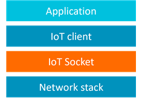

# IoT Socket
Simple IP Socket (BSD like). [The interface documentation is here](https://mdk-packs.github.io/IoT_Socket/html/index.html).

## Overview
This repository contains the code of IoT Socket - a simple [BSD like](https://en.wikipedia.org/wiki/Berkeley_sockets) IP socket interface that implements the glue logic between IoT cloud connectors (IoT clients) and the underlying communication stack as shown on the picture below.

IoT Socket releases in [CMSIS Pack format](https://www.open-cmsis-pack.org/) are available on [CMSIS Packs page](https://developer.arm.com/tools-and-software/embedded/cmsis/cmsis-packs) under *MDK-Packs* category and can be used in environments supporting the CMSIS-Pack concept. Additionally, a generator script `./gen_pack.sh` is provided for building the pack from the repository.

### Supported network stacks
IoT Socket implementation variants are available for the following network stacks:
- [MDK-Middleware Network](https://www.keil.com/pack/doc/mw/Network/html/index.html)
- [lwIP](https://en.wikipedia.org/wiki/LwIP)
- [CMSIS-Driver WiFi](https://arm-software.github.io/CMSIS_5/Driver/html/group__wifi__interface__gr.html)

With the **IoT Socket Multiplexer** functionality it is possible to retarget communication to a different socket interface at run-time (for example from a wireless to wired connection).

### Supported IoT clients

Typically, a user application does not call IoT Socket APIs directly, and relies on the IoT client interface that manages connectivity to the target service in the cloud.

An IoT client may already use IP sockets for communication and so can be easily ported to IoT Socket API. For cases when secure SSL/TLS sockets are required [mbed TLS](https://www.trustedfirmware.org/projects/mbed-tls/) can be used. [CMSIS-mbedTLS](https://github.com/ARM-software/CMSIS-mbedTLS) extends the mbedTLS library to use the IoT Socket API for network communication and so enables support for various IoT clients.

Following IoT client implementations work on top of the IoT Socket API either directly or via CMSIS-mbedTLS:

- [MDK-Packs/AWS_IoT_Device](https://github.com/MDK-Packs/AWS_IoT_Device)
- [MDK-Packs/Azure_IoT](https://github.com/MDK-Packs/Azure_IoT)
- [MDK-Packs/Google_IoT_Device](https://github.com/MDK-Packs/Google_IoT_Device)
- [MDK-Packs/Paho_MQTT](https://github.com/MDK-Packs/Paho_MQTT)
- [MDK-Packs/Watson_IoT_Device](https://github.com/MDK-Packs/Watson_IoT_Device)

[Keil Application Note 312](https://developer.arm.com/documentation/kan312) explains operation of these IoT clients.

## Repository structure

| Directory/File                | Description                                         |
|:------------------------------|:----------------------------------------------------|
| `./documentation/`            | IoT Socket documentation sources for Doxygen        |
| `./include/`                  | Header files with the IoT Socket API                |
| `./source/`                   | IoT Socket implementations                          |
| `./source/lwip/`              | Implementation for the lwIP network stack           |
| `./source/mdk_network/`       | Implementation for the MDK-Middleware network stack |
| `./source/wifi/`              | Implementation for a WiFi CMSIS-Driver              |
| `./source/mux/`               | IoT Socket Multiplexer                              |
| `./template/`                 | Template sources for custom implementation          |
| `./LICENSE.txt`               | License text for the repository content             |
| `./MDK-Packs.IoT_Socket.pdsc` | Pack description file                               |
| `./gen_pack.sh`               | Pack generation script                              |

## Build IoT Socket CMSIS pack

To build an IoT Socket CMSIS pack:
- Verify that following tools are installed on the PC:
  - git bash (e.g. for Windows: https://gitforwindows.org/)
  - ZIP archive creation utility (e.g. [7-Zip](http://www.7-zip.org/download.html))
  - Doxygen version 1.9.2 (https://sourceforge.net/projects/doxygen/files/rel-1.9.2/)
- Checkout this repository. For example in git bash with `git clone https://github.com/MDK-Packs/IoT_Socket`.
- In the local repository folder execute `./gen_pack.sh` in the bash shell.
  - this creates a pack file (for example `MDK-Packs.IoT_Socket.1.3.0.pack`) and places it directly in the local repo folder.

## Examples

[keil.com/iot](https://www2.keil.com/iot) references example projects that implement wired and wireless connectivity to popular cloud services using extended IoT clients over IoT Socket interface.

## License

IoT Socket is provided under [Apache 2.0](https://opensource.org/licenses/Apache-2.0) license.

## Related GitHub repositories

| Repository                  | Description                                               |
|:--------------------------- |:--------------------------------------------------------- |
| [CMSIS](https://github.com/ARM-software/cmsis_5)                 | CMSIS repository     |
| [CMSIS-mbedTLS](https://github.com/ARM-software/CMSIS-mbedTLS)   | CMSIS pack for mbedTLS with an extension using IoT Socket API |
| [MDK-Packs](https://github.com/mdk-packs)                        | Contains reference implementations of IoT cloud connectors that work on top of IoT Socket interface |
