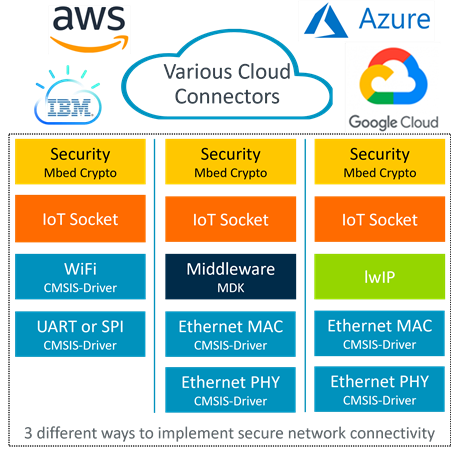

# Overview {#mainpage}

The IoT Socket pack provides a simple [**IP Socket API**](./modules.html) ([BSD like](https://en.wikipedia.org/wiki/Berkeley_sockets)) that implements the glue logic between IoT cloud connectors (IoT clients) and the underlying communication stack as shown on the picture below.

The IoT Socket implementation is maintained in a public [GitHub repository](https://github.com/MDK-Packs/IoT_Socket). Its releases in [CMSIS Pack format](https://www.open-cmsis-pack.org/) are available on [CMSIS Packs page](https://developer.arm.com/tools-and-software/embedded/cmsis/cmsis-packs) under *MDK-Packs* category and can be used in environments supporting the CMSIS-Pack concept.

Section \ref iot_socket_using describes how to integrate the IoT Socket components in a project and section [**Reference**](./modules.html) provides detailed documentation of available APIs.

## Supported network stacks {#iot_stacks}
IoT Socket implementation variants are available for the following network stacks:
- [MDK-Middleware Network](https://www.keil.com/pack/doc/mw/Network/html/index.html)
- [lwIP](https://en.wikipedia.org/wiki/LwIP)
- [CMSIS-Driver WiFi](https://arm-software.github.io/CMSIS_5/Driver/html/group__wifi__interface__gr.html)

With the \ref iot_socket_mux functionality it is possible to retarget communication to a different socket interface at run-time (for example from a wireless to wired connection).

## Supported IoT clients {#iot_clients}

Typically, a user application does not call IoT Socket APIs directly, and relies on the IoT client interface that manages connectivity to the target service in the cloud.

An IoT client may already use IP sockets for communication and so can be easily ported to IoT Socket API. For cases when secure SSL/TLS sockets are required [mbed TLS](https://www.trustedfirmware.org/projects/mbed-tls/) can be used. [CMSIS-mbedTLS](https://github.com/ARM-software/CMSIS-mbedTLS) extends the mbedTLS library to use the IoT Socket API for network communication and so enables support for various IoT clients.

Following IoT client implementations work on top of the IoT Socket API either directly or via CMSIS-mbedTLS:

- [MDK-Packs/AWS_IoT_Device](https://github.com/MDK-Packs/AWS_IoT_Device)
- [MDK-Packs/Azure_IoT](https://github.com/MDK-Packs/Azure_IoT)
- [MDK-Packs/Google_IoT_Device](https://github.com/MDK-Packs/Google_IoT_Device)
- [MDK-Packs/Paho_MQTT](https://github.com/MDK-Packs/Paho_MQTT)
- [MDK-Packs/Watson_IoT_Device](https://github.com/MDK-Packs/Watson_IoT_Device)

[Keil Application Note 312](https://developer.arm.com/documentation/kan312) explains operation of these IoT clients.

## Examples {#examples}

[keil.com/iot](https://www2.keil.com/iot) references example projects that implement wired and wireless connectivity to popular cloud services using extended IoT clients over IoT Socket interface. Figure below demonstrates the concept.

## Limitations {#limits}

The table below lists the differences that IoT socket has comparing to BSD socket capabilities.

|Functionality     | Support in IoT Socket  | Support in BSD Socket
|------------------|------------------------|-------------------
| Address family   | Only IPv4 and optionally IPv6, see \ref iotSocketAddressFamily. | Many other address families.
| Socket type      | Only STREAM and DGRAM, see \ref iotSocketType.   | Many other socket types.
| Socket protocol  | Only TCP and UDP, see \ref iotSocketProtocol.    | Many other protocols.
| Socket options   | Only reduced set, see \ref iotSocketOptions.     | Many other socket options.
| Address representation | Uses pointer to array of bytes, 4-bytes for IPv4, 16-bytes for IPv6, length is supplied with "ip_len" parameter. Port number is specified in host byte order Little Endian (LE). | Uses structure "sockaddr" that contains address family, IP address and port number. IP address and port number are specified in network byte order Big Endian (BE).
| Errors   | Returns error code as specified in \ref iotSocketReturnCodes.  | Returns -1 and sets the global "errno" on failure.
| Host name resolving   | Function \ref iotSocketGetHostByName retrieves IPv4 or IPv6 address, requested address family is specified in "af" parameter. | Function "gethostbyname" retrieves only IPv4 addresses. The API function "getaddrinfo" is used to retrieve IPv4 or IPv6 addresses.
| Read/write ability check1 | Uses receive functions called with parameter len=0. The function returns 0 if the socket is readable or writeable, otherwise the error code. There is no "select" function available. | Uses "select" function with a 0-timeout to check if the socket is readable or writeable.
| Address conversion | APIs have no address conversion functions between ASCII (dot format) and network format.    | Supports address conversion between ASCII and network format: "inet_addr", "inet_aton", "inet_ntoa", "inet_pton", "inet_ntop"

> 1 Readable/writeable socket would not block on a send/receive call.

## License {#license}

IoT Socket is provided under [Apache 2.0](https://opensource.org/licenses/Apache-2.0) license.
