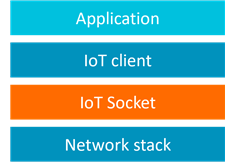
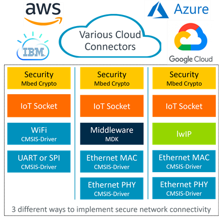

# Overview {#mainpage}

The IoT Socket pack provides a simple [**IP Socket API**](./Modules.html) ([BSD like](https://en.wikipedia.org/wiki/Berkeley_sockets)) that implements the glue logic between IoT cloud connectors (IoT clients) and the underlying communication stack as shown on the picture below.

The IoT Socket implementation is maintained in a public [GitHub repository](https://github.com/MDK-Packs/IoT_Socket). Its releases in [CMSIS Pack format](https://www.open-cmsis-pack.org/) are available on [CMSIS Packs page](https://developer.arm.com/tools-and-software/embedded/cmsis/cmsis-packs) under *MDK-Packs* category and can be used in environments supporting the CMSIS-Pack concept.

Section \ref iot_socket_using describes how to integrate the IoT Socket components in a project and section [**Reference**](./modules.html) provides detailed documentation of available APIs.

## Supported network stacks {#iot_stacks}
IoT Socket implementation variants are available for the following network stacks:
- [MDK-Middleware Network](https://www.keil.com/pack/doc/mw/Network/html/index.html)
- [lwIP](https://en.wikipedia.org/wiki/LwIP)
- [CMSIS-Driver WiFi](https://arm-software.github.io/CMSIS_5/Driver/html/group__wifi__interface__gr.html)

With the \ref iot_socket_mux functionality it is possible to retarget communication to a different socket interface at run-time (for example from a wireless to wired connection).

## Supported IoT clients {#iot_clients}

Typically, a user application does not call IoT Socket APIs directly, and relies on the IoT client interface that manages connectivity to the target service in the cloud.

An IoT client may already use IP sockets for communication and so can be easily ported to IoT Socket API. For cases when secure SSL/TLS sockets are required [mbed TLS](https://www.trustedfirmware.org/projects/mbed-tls/) can be used. [CMSIS-mbedTLS](https://github.com/ARM-software/CMSIS-mbedTLS) extends the mbedTLS library to use the IoT Socket API for network communication and so enables support for various IoT clients.

Following IoT client implementations work on top of the IoT Socket API either directly or via CMSIS-mbedTLS:

- [MDK-Packs/AWS_IoT_Device](https://github.com/MDK-Packs/AWS_IoT_Device)
- [MDK-Packs/Azure_IoT](https://github.com/MDK-Packs/Azure_IoT)
- [MDK-Packs/Google_IoT_Device](https://github.com/MDK-Packs/Google_IoT_Device)
- [MDK-Packs/Paho_MQTT](https://github.com/MDK-Packs/Paho_MQTT)
- [MDK-Packs/Watson_IoT_Device](https://github.com/MDK-Packs/Watson_IoT_Device)

[Keil Application Note 312](https://developer.arm.com/documentation/kan312) explains operation of these IoT clients.

## Examples {#examples}

[keil.com/iot](https://www2.keil.com/iot) references example projects that implement wired and wireless connectivity to popular cloud services using extended IoT clients over IoT Socket interface. Figure below demonstrates the concept.

## License {#license}

IoT Socket is provided under [Apache 2.0](https://opensource.org/licenses/Apache-2.0) license.
