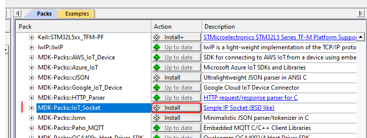
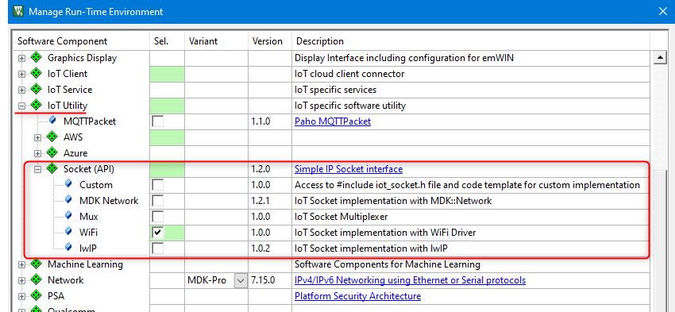
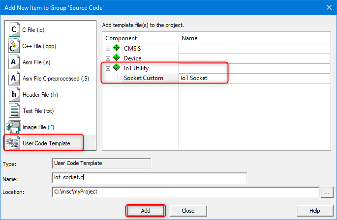

# Using IoT Socket {#iot_socket_using}

IoT Socket is available in [CMSIS Pack format](https://www.open-cmsis-pack.org/) that simplifies its integration and lifecycle management in complex IoT projects. Section \ref examples provides information about example projects with IoT Socket interface.

This page explains how to use the IoT Socket pack. It takes [Keil MDK](https://developer.arm.com/tools-and-software/embedded/keil-mdk) as the target IDE, but the approach is similar for other development environments supporting CMSIS-Pack concept.

## Pack installation {#iot_socket_install}

IoT Socket pack is public and can be added to the target IDE with the supported pack management service.

With Keil MDK use the [**Pack Installer**](https://www.keil.com/support/man/docs/uv4/uv4_ca_packinstaller.htm) utility and in the [*Packs tab*](https://www.keil.com/support/man/docs/uv4/uv4_ca_packinst_packs.htm) - *Generic* category install the *MDK-Packs\::IoT_Socket* pack.

Alternatively, the pack file can be downloaded directly from the [CMSIS Packs page](https://developer.arm.com/tools-and-software/embedded/cmsis/cmsis-packs) (in the *MDK-Packs* category). Double-click the local pack file and it will be added to your development environment.

## Component selection {#iot_socket_select}

IoT Socket pack contains following implementation variants:

- **Custom**: adds the API header file (`iot_socket.h`) to the include list and enables a template for custom IoT Socket implementation. See \ref iot_socket_custom for details.
- **MDK-Network**: provides IoT Socket implementation for the [MDK-Middleware Network stack](https://www.keil.com/pack/doc/mw/Network/html/index.html).
- **Mux**: implements IoT Socket Multiplexer that allows to retarget communication to a different socket interface at run-time (for example from wireless to wired). See \ref iot_socket_mux for details.
- **WiFi**: provides IoT Socket over [CMSIS-Driver WiFi interface](https://arm-software.github.io/CMSIS_5/Driver/html/group__wifi__interface__gr.html).
- **lwIP**: implements IoT Socket on top of the [lwIP stack](https://en.wikipedia.org/wiki/LwIP).

You can add an IoT Socket variant to a µVision project as follows:
- Open [Manage Run-Time Environment](https://www.keil.com/support/man/docs/uv4/uv4_ca_rtemanager.htm).
- Expand *IoT Utility* group, then *Socket (API)* group.
- Select a single IoT Socket implementation variant.
- Resolve any conflicts reported in the *Validation Output* by adding required components to the project. Press *OK*.

### Custom IoT Socket {#iot_socket_custom}

*Custom* variant of the IoT Socket provides a template for implementing custom IoT Socket. Use the template in a µVision project as follows:
 - right-click on the target folder in the _Project_ view and in the context menu select *Add New Item to Group '\<group name\>'...*.
 - In the open dialog select *User Code Template*, then expand *IoT Utility* component and select *Socket:Custom*.
 - In the *Name* field specify the filename to be used. By default it is `iot_socket.c`.
 - Click *Add* button and the specified template file will be added to the target folder.

 

 - In the added template file provide custom implementation for the IoT Socket stub functions.

### IoT Socket Multiplexer {#iot_socket_mux}

*Mux* variant of the IoT Socket executes the API functions based on the mapping provided by the user with \ref iotSocketRegisterApi function. This mechanism allows to retarget IoT communication to a different interface at run-time.

For example the procedure for enabling both MDK-Network and WiFi interfaces would be as follows:
- Make sure that all necessary software components for MDK-Middleware and WiFi are present in the project.
- Add IoT Socket in *Mux* variant to your project.
- Add an IoT socket implementation for MDK-Middleware Network stack:
  - copy `source\mdk_network\iot_socket.c` from the IoT Socket pack to your application folder.
  - rename the copied file, for example to `iot_socket_mdk.c`.
  - add the file to the application project.
  - rename all `iotSocketXXX` functions in the file, for example by changing the prefix and having them as `mdkSocketXXX`.
- Add an IoT socket implementation for WiFi interface:
  - copy `source\wifi\iot_socket.c` from the IoT Socket pack to your application folder.
  - rename the copied file, for example to `iot_socket_wifi.c`.
  - add the file to the application project.
  - rename all `iotSocketXXX` functions in the file, for example by changing the prefix and having them as `wifiSocketXXX`.
- In the application code define two API access structures of \ref iotSocketApi_t type that map the MDK-Network (`mdkSocketXXX`) and WiFi (`wifiSocketXXX`) socket functions respectively.
- Register the API of the target communication interface using \ref iotSocketRegisterApi.

## Operation flow {#iot_socket_flow}

A user application typically does not need to call the IoT Socket APIs directly, and instead can rely on the IoT Client interface that manages connectivity to the target service in the cloud (AWS, Azure, Google, proprietary). [Keil Application Note 312](https://developer.arm.com/documentation/kan312) explains operation of such IoT clients and shows how IoT Socket is used by them.

[**IoT Socket functions**](./group__iotSocketAPI.html) resemble operation of [BSD Socket APIs](https://en.wikipedia.org/wiki/Berkeley_sockets) and so the principles of BSD sockets shall be followed when extending IoT clients with IoT Socket support, or when implementing custom IoT Socket variants on top of other network interfaces.
